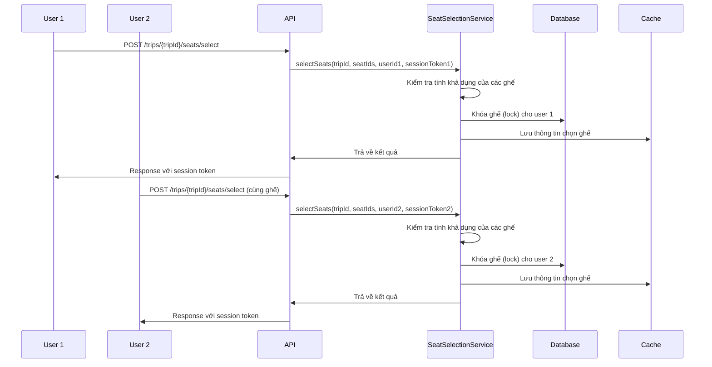
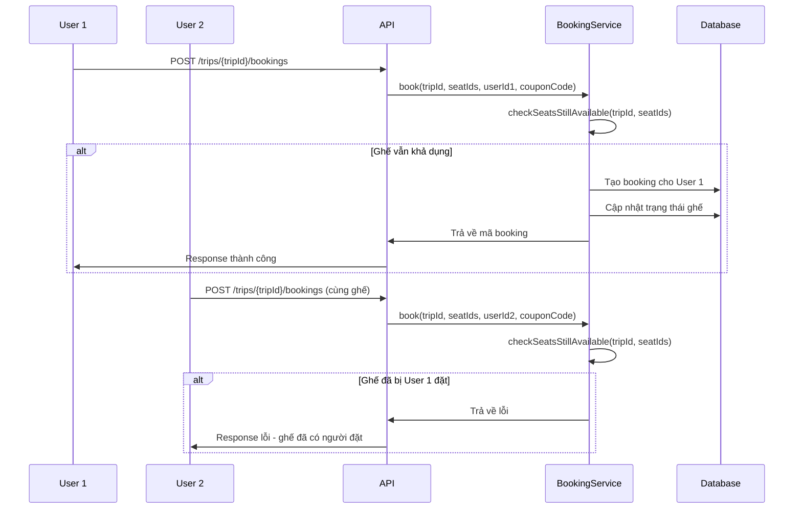

# Seat Selection Flow - Hệ thống chọn và đặt ghế

## Tổng quan

Hệ thống đặt ghế mới được thiết kế để đảm bảo tính công bằng và tránh xung đột khi nhiều user cùng muốn đặt cùng một ghế. Flow hoạt động theo 2 bước:

1. **Chọn ghế (Seat Selection)**: User chọn ghế và được giữ trong 30 giây
2. **Đặt ghế (Booking)**: User xác nhận đặt ghế - ai đặt trước thì được trước

## Các yêu cầu chính

- ✅ User có thể chọn nhiều ghế trong 1 xe của 1 trip
- ✅ Nhiều user có thể cùng chọn cùng một ghế
- ✅ Ai đặt (booking) trước thì được ghế trước
- ✅ Thời gian giữ ghế: 30 giây

## Flow hoạt động

### 1. Chọn ghế (Seat Selection)



**API Endpoint**: `POST /trips/{tripId}/seats/select`

**Request Body**:
```json
{
    "seat_ids": [1, 2, 3]
}
```

**Response**:
```json
{
    "success": true,
    "message": "Chọn ghế thành công",
    "data": {
        "selected_seats": [1, 2, 3],
        "failed_seats": [],
        "lock_duration": 30
    },
    "session_token": "abc123..."
}
```

### 2. Đặt ghế (Booking)



**API Endpoint**: `POST /trips/{tripId}/bookings`

**Request Body**:
```json
{
    "seat_ids": [1, 2, 3],
    "coupon_code": "DISCOUNT10"
}
```

**Response**:
```json
{
    "success": true,
    "message": "Đặt ghế thành công",
    "data": {
        "codes": ["ABC123", "DEF456", "GHI789"],
        "trip_id": 1
    }
}
```

## Các API Endpoints

### Seat Selection API

| Method | Endpoint | Description |
|--------|----------|-------------|
| POST | `/trips/{tripId}/seats/select` | Chọn ghế |
| POST | `/trips/{tripId}/seats/unselect` | Hủy chọn ghế |
| DELETE | `/trips/{tripId}/seats/unselect-all` | Hủy tất cả ghế đang chọn |
| GET | `/trips/{tripId}/seats/selections` | Lấy danh sách ghế đang chọn |
| POST | `/trips/{tripId}/seats/check-status` | Kiểm tra trạng thái ghế |

### Booking API

| Method | Endpoint | Description |
|--------|----------|-------------|
| POST | `/trips/{tripId}/bookings` | Đặt ghế |
| GET | `/trips/{tripId}/bookings/selections` | Lấy danh sách ghế đang chọn |
| DELETE | `/trips/{tripId}/bookings/selections` | Hủy tất cả ghế đang chọn |

## Các trường hợp xử lý

### 1. Nhiều user cùng chọn cùng một ghế

**Xử lý**: Cho phép nhiều user cùng chọn cùng một ghế
**Kết quả**: Mỗi user đều có thể chọn ghế và được giữ trong 30 giây

### 2. Ai đặt trước thì được trước

**Nguyên tắc**: Khi user đặt ghế, hệ thống kiểm tra xem ghế có còn khả dụng không
**Xử lý**: Nếu ghế đã bị người khác đặt trước thì trả về lỗi
**Message**: "Một hoặc nhiều ghế đã có người khác đặt trước. Vui lòng chọn ghế khác."

### 3. Thời gian giữ ghế hết hạn

**Xử lý**: Tự động mở khóa ghế khi kiểm tra tính khả dụng
**Lưu ý**: Không cần cron job, hệ thống tự động xử lý khi user thao tác

### 4. User không cần chọn ghế trước khi đặt

**Xử lý**: User có thể đặt ghế trực tiếp mà không cần chọn trước
**Lưu ý**: Việc chọn ghế chỉ mang tính hiển thị, không ảnh hưởng đến việc đặt ghế

## Cấu trúc Database

### TripSeatStatus Table

```sql
CREATE TABLE trip_seat_statuses (
    id BIGINT PRIMARY KEY AUTO_INCREMENT,
    trip_id BIGINT NOT NULL,
    seat_id BIGINT NOT NULL,
    is_booked BOOLEAN DEFAULT FALSE,
    booked_by BIGINT NULL,
    locked_by BIGINT NULL,
    lock_expires_at TIMESTAMP NULL,
    created_at TIMESTAMP NULL,
    updated_at TIMESTAMP NULL,
    
    UNIQUE KEY unique_trip_seat (trip_id, seat_id),
    FOREIGN KEY (trip_id) REFERENCES trips(id),
    FOREIGN KEY (seat_id) REFERENCES seats(id),
    FOREIGN KEY (booked_by) REFERENCES users(id),
    FOREIGN KEY (locked_by) REFERENCES users(id)
);
```

**Lưu ý**: 
- `locked_by` có thể thay đổi khi nhiều user cùng chọn ghế
- `is_booked` và `booked_by` chỉ được set khi user thực sự đặt ghế

### Cache Structure

**Key**: `user_selections:{userId}`
**Value**:
```json
{
    "1": {  // trip_id
        "seat_ids": [1, 2, 3],
        "session_token": "abc123...",
        "selected_at": "2024-01-01T10:00:00Z"
    }
}
```

## Broadcasting Events

### 1. SeatSelecting
- **Channel**: `trips.{tripId}`
- **Event**: `seat.selecting`
- **Data**: `{tripId, seatId, byToken, byUserId, hintTtl}`

### 2. SeatUnselecting
- **Channel**: `trips.{tripId}`
- **Event**: `seat.unselecting`
- **Data**: `{tripId, seatId, byToken}`

### 3. SeatBooked
- **Channel**: `trips.{tripId}`
- **Event**: `seat.booked`
- **Data**: `{tripId, seatId}`

## Security Considerations

1. **Session Token**: Mỗi lần chọn ghế cần có session token riêng
2. **User Validation**: User không cần chọn ghế trước khi đặt
3. **Rate Limiting**: Có thể áp dụng rate limiting cho API chọn ghế
4. **Authentication**: Tất cả API đều yêu cầu authentication

## Testing

### Test Cases

1. **Chọn ghế thành công**
2. **Nhiều user cùng chọn cùng một ghế**
3. **Đặt ghế thành công mà không cần chọn trước**
4. **Ai đặt trước thì được trước**
5. **Hủy chọn ghế**
6. **Thời gian giữ ghế hết hạn**

### Test Commands

```bash
# Test seat selection
php artisan test --filter=SeatSelectionTest

# Test booking flow
php artisan test --filter=BookingFlowTest
```

## Troubleshooting

### Common Issues

1. **Ghế không thể chọn**: Kiểm tra trạng thái ghế và lock
2. **Không thể đặt ghế**: Kiểm tra xem ghế có bị người khác đặt trước không
3. **Ghế bị mất lock**: Kiểm tra thời gian hết hạn lock

### Debug Commands

```bash
# Kiểm tra trạng thái ghế
php artisan tinker
>>> app(App\Services\SeatSelectionService::class)->getUserSelections(1, 1);
```

## Thay đổi so với phiên bản cũ

### Đã loại bỏ:
1. **Kiểm tra user có đang chọn ghế ở trip khác**: User có thể chọn ghế ở nhiều trip cùng lúc
2. **Giới hạn mỗi ghế chỉ 1 user chọn**: Nhiều user có thể cùng chọn cùng một ghế
3. **Bắt buộc chọn ghế trước khi đặt**: User có thể đặt ghế trực tiếp
4. **Cron job cleanup**: Không cần thiết với logic mới

### Giữ nguyên:
1. **Thời gian giữ ghế**: 30 giây
2. **Nguyên tắc ai đặt trước thì được trước**
3. **Broadcasting events**
4. **Tự động cleanup lock hết hạn khi kiểm tra tính khả dụng**
